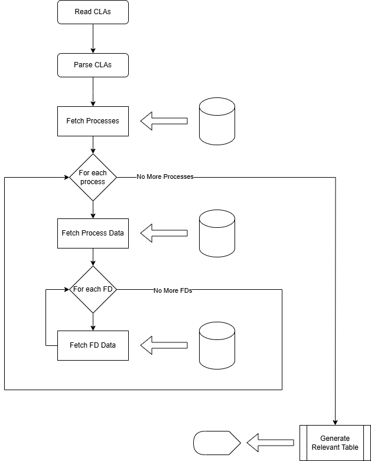

# CSCB09 Assignment 2 - FD Tables
By: Bo Rui Duanmu

March 9th, 2025

## Introduction
This program displays the tables which keeps track of open files, file descriptors, processes, and other information pertaining to the OS.

## How I Approached the Problem
I wanted to split my approach to this program into three sections: getting the input, retrieving and processing data, and outputting the results. Getting the input was quite simple, as we were given very clear and explicit formats in which our program was going to be used. We were told all the flags we needed to keep track of and what to show given these flags, so all I needed to do was get these instructions and store them. As for retrieving data, I wanted to do a similar approach to how I retrieved data in the first assignment, which included opening relevant files and storing the data, which I then process into presentable forms. I wanted to store this data in Linked Lists as I would not know how many processes/FDs there would be in total so I needed an expandable list structure. I knew outputting the data was going to be much simpler than in assignment 1, as I am not outputting any graphs which update in real time, so I planned on not using any escape codes and mainly using tabs for formatting. 

## Implementation
The program works by first taking the user input and storing them in a CDT called `tool_specifications`. This keeps track of what tables to output, if we want the program to store results in files, and thresholds and target PIDs if needed. Then, we get the processes and their PIDs from `/proc/` by seeing which directories are numerical and storing them in a Linked List CDT `ProcessNode`. From there, we go through each process to get their file descriptors, also storing them in a Linked List CDT, this one called `FDNode`. Then for each each FD, we get the filename and Vnode, as well as update the total number of FDs, stored in the head of the list. Lastly, the relevant data gets outputted and stored in files if needed. 

### `process_node`
`process_node` defines a CDT called `ProcessNode` which stores three things: an int `pid` which is the PID of that process, a list of FDNodes called `fds` which stores the FDs, and a ProcessNode `next` which is the next process in the list. 

This module has three functions:

* `create_process`
    * This function allocates memory for and creates a ProcessNode. It sets its `pid` and `fds` fields to the info given from the parameters.
* `free_processes`
    * This function takes in a list of ProcessNodes and frees all of them as well as all of their FDNodes. 
* `get_processes`
    * This function gets all the processes. It first opens the `/proc/` directory and makes a ProcessNode list and loops through all the entries, keeping track of all the entries with numerical names. If it does, it creates a new ProcessNode with the name of the entry as its `pid`. It gets the FDs using `get_fds` from the `fd_node` module. If the FDs are not able to be accessed, it will skip that process. It then appends that process to the list. Lastly, it closes the directory and returns the list. 

### `fd_node`
`fd_node` defines a CDT called `FDNode` which stores five things: an int `fd` which is the FD number, a string `filename` which is the filename, a long `vnode` which is the vnode number, an int `size` which is the total number of FDNodes in the list (Note: only the head's `size` field will be correct, all other nodes in the list will have a `size` of 1), and a FDNode next which is the next FD in the list. 

This module has four functions:

* `create_fd`
    * This function allocates memory for and creates an FDNode. It sets its `fd`, `filename`, `vnode` fields to the info given from the parameters.
* `free_processes`
    * This function takes in a list of FDNodes and frees all of them.
* `get_fds`
    * This function takes in an int `pid` gets all the FDs for that PID. It first opens the `/proc/PID/fd/` directory, where `PID` is the given PID, and makes a FDNode list and loops through all the entries, keeping track of all the entries with numerical names (Note: all the entries in this directory should have numerical names, as the only things in this directory are the FDs). If it does, it stores the FD number using the entry's filename, the actual name of the file retrieved using `get_filename`, and the Vnode number in a new FDNode. It then appends that FD to the list and updates the size of the list. Lastly, it closes the directory and returns the list. 
* `get_filename`
    * This function gets the filename from a symlink. It takes in the path `path` to a symlink, a buffer `filename` to store the filename, and a the length of the filename string `length`. It uses `readlink` to store the filename into the buffer `filename`. If it is unable to read the link, it stores `Filename Unavailable` as the filename. 

### `output_utils`
`output_utils` has eight functions, all of which doing similar things. They all take in a stream and a ProcessNode list and outputs various tables and other info using the given list and into the given stream. With the exception of `print_composite_less_bin`, all the functions will loop through each process and print relevant info using `fprintf`, formatting with tabs, and occasionally print headers and footers as well. `print_composite_less_bin` does the same, but uses `fwrite` instead of `fprintf` to write in binary instead of ASCII. 

### `fd_tables`
`fd_tables` is the driver, and it defines a CDT called `tool_specifications` which stores which tables to show, whether we want to save info to a txt file and/or a bin file, and a threshold and target PID if needed. 

This module has three functions:

* `process_arguments`
    * This function takes in the argument count and argument list and creates a new ToolSpecifications structure to store the specifications of the program. If given any of the flags specified in the assignment description, it will appropriately set the fields of the ToolSpecifications structure. If given no appropriate flags, the default settings will be applied. Any invalid arguments will be ignored. 
* `output_data`
    * This function takes in a ToolSpecifications structure `specs` and a ProcessNode list `processes`. Using the provided processes, it outputs the appropriate tables and data using the functions from `output_utils` according to `specs`. 
* `main`
    * The main function first processes the arguments using `process_arguments`, then gets the processes using `get_processes` from `process_node`, outputs the data using `output_data`, frees the created structures, and exits successfully. 

## Flow Chart

## How to Compile
This file uses a makefile. The `make all` or `make` rule compiles the program using the proper compiler and flags into an executable called `fd_tables` by linking all the `.c` files into a single executable. The `make clean` rule cleans the files by removing the `.o` files and the executable. 

## Expected Results

When not given any flags, the program should output the composite table which includes data for all the processes, their PIDs, their FDs, the filenames, and the Vnodes. When given a flags for specific tables (tables being the process, system wide, Vnodes, composite, and summary tables), only those tables will appear. If an FD threshold is specified, it will list the offending processes. If only the threshold flag is included, the default output (i.e. the composite table) will also be outputted. If an integer is given as the first argument, it will only show info pertaining to the process with that integer as the PID. If any of the output flags are used, it will create or edit the relevant file and store the information in it. 

## Test Cases

Here are some test cases to consider: 

* `./fd_tables`
    * This should output just the composite table.
* `./fd_tables 432`
    * If the program cannot access this process, either due to lack of permissions or because the process does not exist, it will output an error message saying it cannot access this file. Otherwise, it will output the composite table only including process 432.
* `./fd_tables 1 --output_TXT --systemWide --threshold=10 --composite`
    * If the program cannot access this process, either due to lack of permissions or because the process does not exist, it will output an error message saying it cannot access this file. Otherwise, it will output the following tables in this order: the composite table only including process 1, the system wide table only including process 1, and the list of processes with strictly more than 10 FDs. It will also output a modified composite table only including process 1 to a file called `compositeTable.txt`.
* `./fd_tables --output_binary --systemWide --threshold=9 --per-process`
    * This should output the following tables in this order: the process table, the system wide table, and the list of processes with strictly more than 9 FDs. It will also output a modified composite table only including process 1 in binary to a file called `compositeTable.bin`.
* `./fd_tables akdfkjnkja`
    * This should output just the composite table.
* `./fd_tables --composite 432`
    * This should output just the composite table.
* `./fd_tables --composite jknkkkk`
    * This should output just the composite table.
* `./fd_tables 0`
    * This should output just the composite table.
* `./fd_tables -1`
    * This should output just the composite table.
* `./fd_tables --threshold=gfgggggggg`
    * This should output just the composite table.
* `./fd_tables --threshold=0`
    * This should output just the composite table.
* `./fd_tables --threshold=-1234`
    * This should output just the composite table.

## Outputting in ASCII vs Outputting in Binary

All tests were run with five samples. Note the `time` command does not give much accuracy for such a fast program, so take the time statistics with a grain of salt.

`txt` file:
* All processes:
    * Time:
        * Avg: 0.0122 Seconds
        * Standard Deviation: 0.00074833 Seconds
    * Size: 
        * Avg: 14217.6 Bytes
        * Standard Deviation: 1953.13825 Bytes
* One process:
    * Time:
        * Avg: 0.007 Seconds
        * Standard Deviation: 0 Seconds
    * Size: 
        * Avg: 94 Bytes
        * Standard Deviation: 0 Bytes

`bin` file:
* All processes:
    * Time:
        * Avg: 0.012 Seconds
        * Standard Deviation: 0.0016733 Seconds
    * Size: 
        * Avg: 17155 Bytes
        * Standard Deviation: 2679.76334 Bytes
* One process:
    * Time:
        * Avg: 0.0072 Seconds
        * Standard Deviation: 0.0004 Seconds
    * Size: 
        * Avg: 120 Bytes
        * Standard Deviation: 0 Bytes

In terms of speed, likely due to the innaccuracy of the `time` command, I was unable to find much differences between the `txt` and `bin` cases. However, in all cases the size of the `txt` file was smaller than the size of the `bin` files. This is likely because most of the numbers in the output are quite small, likely in the range of numbers where storing them as ASCII is more efficient than storing them an binary numbers. Note these tests were run on my machine, the lab machines tend to have processes with much larger PIDs, so results may differ. 

## Disclaimers

In the case that any file cannot be opened, with the exception of processes and FDs, the program will not function and an error message will be outputted. If a process cannot be accessed it will be skipped unless it was specifically requested, in which case an error message will be outputted. If an FD cannot be accessed it will be skipped. If we cannot get its name, its name will be displayed at `Filename Unavailable`.

The Vnodes displayed are actually the Vnodes of the symlink leading to the FD, meaning you will see discrepancies between the displayed Vnode and the actual Vnode. 